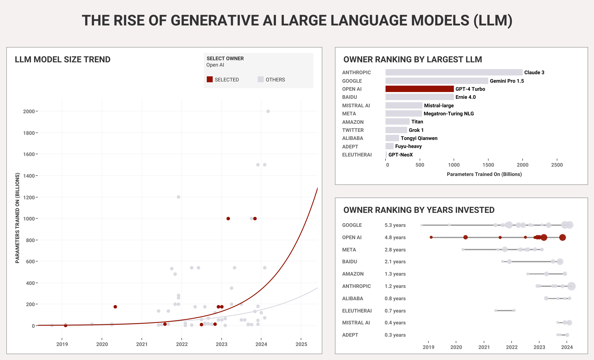

# The Rise and Rise of AI Large Language Models (LLMs)

This project visualizes the explosive growth of **Large Language Models (LLMs)** using data from [Makeover Monday](https://data.world/makeovermonday/the-rise-and-rise-of-llms).  
The Tableau dashboard combines **trend analysis, ranking charts, and interactive filters** to explore:  

- How model sizes have scaled exponentially  
- Which companies are leading the race  
- How long organizations have been investing in LLM development  

Custom **calculated fields** were created to measure years invested, identify the largest models, and enable **parameter-driven interactivity**.

---

##  Objective
- Analyze the **scaling trend of LLMs (2018–2025)**  
- Compare organizations by **largest LLM released, years invested, and total models**  
- Provide **business insights** into competitive dynamics between established leaders (*Google, OpenAI, Baidu*) and emerging startups (*Mistral AI, Adept*)  

---

## 🛠 Project Components

### 1. Data Extraction
- **Source**: Makeover Monday public dataset on LLMs  
- **Extracted fields**: name, owner, parameters (in billions), date
- Imported into **Tableau** via Excel for direct connection  

### 2. Data Design
- Reformatted **date → year** for trend analysis  
- Cleaned and grouped **company names** for consistency  
- Built calculated fields:  
  - **Years Invested** → min/max release dates per owner  
  - **Rank Parameters by Owner** → ranks owners by model size  
  - **Name of Biggest LLM** → identifies top models dynamically with FIXED LOD  
  - **Range of Parameters** → min vs max per owner  
  - **Is Selected Owner** → parameter-driven highlight for interactivity  

### 3. Data Analysis
- **Model Size Trend** → line chart showing exponential growth over time  
- **Owner Ranking by Largest LLM** → bar chart comparing companies by biggest released model  
- **Owner Ranking by Years Invested** → bar chart showing sustained activity  

### 4. Business Insights
-  **Exponential scaling**: Post-2021, LLM sizes grew dramatically, signaling accelerating AI investment  
-  **Market leaders**: Google, OpenAI, and Baidu dominate with the largest releases  
-  **Emerging disruptors**: Startups like Mistral AI and Adept innovate quickly despite late entry  
-  **Strategic advantage**: Early movers (Google, OpenAI) continue to benefit from long-term R&D  

---

##  Technology Used
- **Data Source**: Makeover Monday 
- **Data Cleaning & Prep**: Excel (basic cleaning), Tableau Calculated Fields (advanced transformations)  
- **Visualization**: Tableau (trend lines, rankings, parameter interactivity)  

---

##  What I Learned
- How to use **LOD (Level of Detail) expressions** in Tableau for dynamic calculations  
  - Example: biggest LLM per owner, years invested  
- How to make **technical AI trends accessible** to non-technical audiences  
- That the **AI race is highly competitive**, with exponential scaling reshaping market dynamics  

---

##  Demo

Here are some snapshots of the Tableau dashboard:

